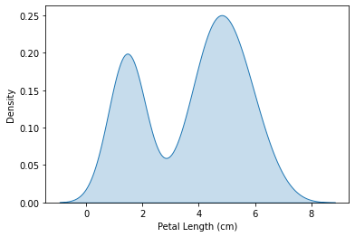

# Tensors

### Definition from WIKI

In mathematics, a tensor is an algebraic object that describes a multilinear relationship between sets of algebraic objects related to a vector space. Tensors may map between different objects such as vectors, scalars, and even other tensors. There are many types of tensors, including scalars and vectors (which are the simplest tensors), dual vectors, multilinear maps between vector spaces, and even some operations such as the dot product. Tensors are defined independent of any basis, although they are often referred to by their components in a basis related to a particular coordinate system.

In other words: It is just a buch of number/data. 0D tensor is a number. 1D tensor is just an array.&#x20;

### Operations with tensors

#### Data Type:&#x20;

<figure><figcaption></figcaption></figure>

Creating a tensor:

```
import torch
a=torch.tensor([0,1,2,3,4])
a.dtype # Data type: will return torch.int64
a.type() # Tensor Type: will return torch.LongTensor
```

Specify a type of tensor:

<pre><code><strong>#Method one: when creating
</strong><strong>a=torch.tensor([0.0,1.0,2.0,3.0],dypte=torch.int32)
</strong><strong>#Or you can also do this:
</strong>a=torch.FloatTensor([0,1,2,3,4]) # result in [0.,1.,2.,3.,4.]
<strong>
</strong><strong>#Method two: Type-casting
</strong><strong>a=a.type(torch.FloatTensor)
</strong><strong>a.type() # will return torch.FloatTensor
</strong></code></pre>

Tensor attributes

```
a.size() # will return torch.Size(5)
a.ndimension() # will return 1
```

Convert from 1D to 2D

```
a_col=a.view(5,1) # first argument for rows, second for columns 
a_col=a.view(-1,1) # same as above, but the number of rows will be found by the program
```

Converting between tensors and numpy\_array

```
numpy_array=np.array([0.0,1.0,2.0])
torch_tensor=torch.from_numpy(numpy_array)
back_to_numpy=torch.tensor.numpy() #note that if numpy_arry is changed, the following 
#variables are also changed 
```

Converting from pandas

```
pandas_series=pd.Series([0.1,2,0.3])
pandas_to_torch=torch.from_numpy.pandas_series.values
```

The elements in a tensor are also tensors.&#x20;

```
new_tensor=torch.tensor([5,2,6,1])

new_tensor[0] # return tensor(5)

new_tensor[0].item() # return 5 => Now we can use this as a python number
```

Indexing and Slicing: similar to a list

```
c=torch.tensor([5,2,6,1])
d=c[1:4] # d: tensor([2,6,1]) => We don't count the number corresponding to the last index
c[3:5]=torch.tensor([300.0,400.0])
```

Basic Operations

```
#Vector Multiplication
u=torch.tensor([1,2])
v=torch.tensor([3,2])
z=u*v # z: tensor([3,4])

#Dot product
dot_result=torch.dot(u,v) #result: 5

#Adding a constant to a tensor
#Broadcast: add the constant to all members

#Universal functions
#mean
mean_u=u.mean() # retrun 1.5

#maximum value
max_v=v.max() # return 3

#pi
np.pi

#sin
x=torch.tensor([0,np.pi/2,np.pi])
y=torch.sin(x) # y: tensor([0,1,0])

#plotting 
torch.linespace(-2,2,steps=5) #Starting point, end point, number of samples to generate
#-2,-1,0,1,2

x=torch.linspace(0,2*np.pi,100)
y=torch.sin(x)

import matplotlib.pyplot as plt
%mabplotlib inline
plt.plot(x.numpy(),y.numpy())
```
